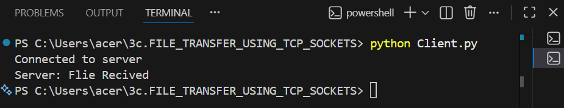
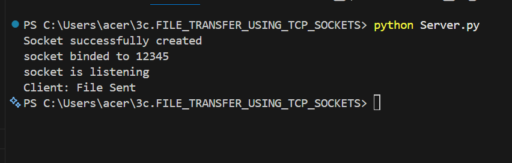

# 3c.CREATION FOR FILE TRANSFER USING TCP SOCKETS
## AIM
To write a python program for creating File Transfer using TCP Sockets Links
## ALGORITHM:
1. Import the necessary python modules.
2. Create a socket connection using socket module.
3. Send the message to write into the file to the client file.
4. Open the file and then send it to the client in byte format.
5. In the client side receive the file from server and then write the content into it.
## PROGRAM
### Client.py
```
import socket
client_socket = socket.socket(socket.AF_INET, socket.SOCK_STREAM)
client_socket.connect(("127.0.0.1", 12345  ))
print("Connected to server")
fh=open("story.txt","r")    
data=fh.readlines()  
client_socket.send(' '.join(data).encode())
print("Server: Flie Recived")
client_socket.close()

```
### Server.py
```
import socket             
s = socket.socket()         
print ("Socket successfully created")
port = 12345                
s.bind(('', port))         
print ("socket binded to %s" %(port)) 
s.listen(5)     
print ("socket is listening")    
c, addr = s.accept()   
message = c.recv(1024).decode()
fh2=open("story_copy.txt","w")
fh2.write(message)
print("Client: File Sent")
c.close()

```
## OUPUT:



## RESULT
Thus, the python program for creating File Transfer using TCP Sockets Links was 
successfully created and executed.
